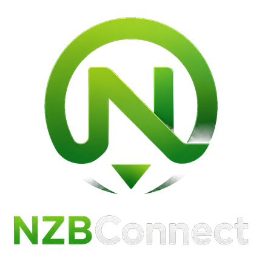
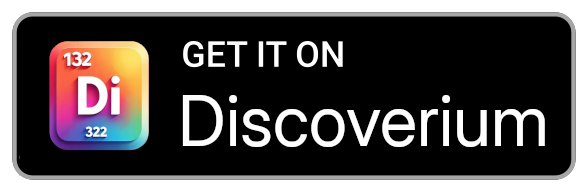

<h1 align="center">NZBConnect</h1>

  <picture>
    <source
      width="256px"
      media="(prefers-color-scheme: dark)"
      srcset="assets/logo/app_logo.png"
    >
    
  </picture>

  <a href="https://discord.gg/vDuSpJEDrW">
    <picture>
      <source height="24px" media="(prefers-color-scheme: dark)" srcset="/assets/icons/Discord.png" />
      
    </picture>
  </a>&nbsp;&nbsp;&nbsp;
  <a href="https://old.reddit.com/r/NZBConnect">
    <picture>
      <source height="24px" media="(prefers-color-scheme: dark)" srcset="/assets/icons/Reddit.png" />
      
    </picture>
  </a>

A Usenet download manager written in Kotlin for Android. It connects to your SABnzbd and NZBGet servers and searches Newznab indexers. It has no ads, and a clean UI.

 

[Releases](https://github.com/cygnusx-1-org/NZBConnect/releases)
[License](https://github.com/cygnusx-1-org/NZBConnect/blob/master/LICENSE)
[GitHub issues](https://github.com/cygnusx-1-org/NZBConnect/issues)

---

# Installation
You can easily install and update NZBConnect with [Discoverium](https://github.com/cygnusx-1-org/Discoverium/) via its search button.

    <picture>
      <source media="(prefers-color-scheme: dark)" srcset="assets/badges/discoverium.png" height="60">
      
    </picture>
  </a>&nbsp;&nbsp;&nbsp;
  <a href="https://github.com/cygnusx-1-org/NZBConnect/releases/latest">
    <picture>
      <source media="(prefers-color-scheme: dark)" srcset="assets/badges/github.png" height="60">
      
    </picture>
  </a>

## Verification
org.cygnusx1.nzbconnect 4F:34:BF:D2:0C:C4:84:15:10:E7:EF:FB:75:CB:FB:C2:3A:09:C2:CA:92:D0:4C:ED:5B:33:6C:8F:25:A0:D3:E3

You can verify it with [AppVerifier](https://github.com/soupslurpr/AppVerifier).

# License
Distributed under the GPL-3.0 License. See <a href="https://github.com/cygnusx-1-org/NZBConnect/blob/master/LICENSE">LICENSE</a> for more information.

# Contact
nzbconnect@cygnusx-1.org (Owner)

Project Link: [https://github.com/cygnusx-1-org/NZBConnect](https://github.com/cygnusx-1-org/NZBConnect)
